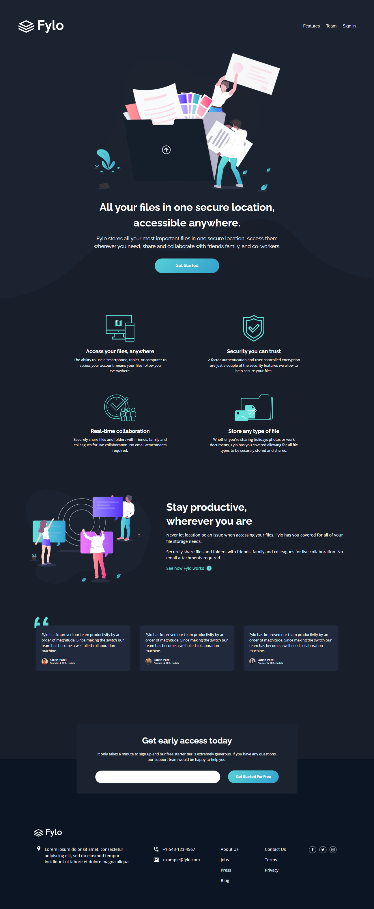

# Frontend Mentor - Fylo dark theme landing page solution

This is a solution to the [Fylo dark theme landing page challenge on Frontend Mentor](https://www.frontendmentor.io/challenges/fylo-dark-theme-landing-page-5ca5f2d21e82137ec91a50fd). Frontend Mentor challenges help you improve your coding skills by building realistic projects. 

## Table of contents

- [The challenge](#the-challenge)
- [Screenshot](#screenshot)
- [Links](#links)
- [Built with](#built-with)
- [Author](#author)

### The challenge

Users should be able to:

- View the optimal layout for the site depending on their device's screen size
- See hover states for all interactive elements on the page

### Screenshot

### Links

- Solution URL: [Add solution URL here](https://your-solution-url.com)
- Live Site URL: [https://mell789.github.io/fylo-dark-theme-landing-page/](https://mell789.github.io/fylo-dark-theme-landing-page/)

### Built with

- HTML
- CSS
- Flexbox
- Mobile-first workflow
- [Bootstrap](https://getbootstrap.com/)

## Author

- Frontend Mentor - [@Mell789](https://www.frontendmentor.io/profile/Mell789)
- Github - [@Mell789](https://github.com/Mell789)
